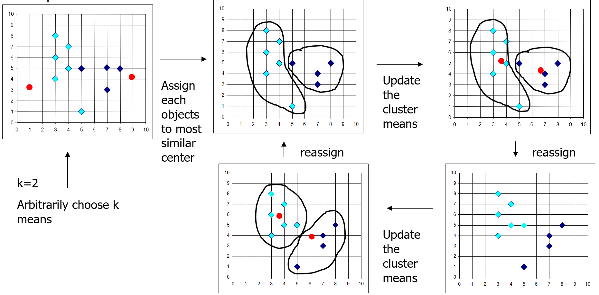

# KMeans:

K-Means Algorithm needs to initilize the K size (the number of clusters you want)

Algorithm:
1. initilize K means
2. calculate the distance from each point to K means
3. choose the shortest distance, and put the point into the corresponding cluster
4. update K means

Loop from 1 to 4 until K means are keep unchange 

The steps can be expressed as below picture:


---

How to use:

initialize your data with the formation of : [[$x_1, x_2, 0$] for all the data] 

invoke the function kMeans(k, data)

Examples:

```python
k = 3 # set class number
# The input data, the third attribute is the class number, initiliza with 0
data = [[17, 12, 0], [5, 12, 0], [17, 14, 0], [5, 16, 0], [20, 15, 0], [3, 9, 0], [12, 3, 0], [12, 32, 0]]

kMeans(k, data)
```

Result:

```
Cluster  0 :  [[5, 12], [5, 16], [3, 9], [12, 3]]  with mean =  [6.25, 10.0]
Cluster  1 :  [[17, 12], [17, 14], [20, 15]]  with mean =  [18.0, 13.666666666666666]
Cluster  2 :  [[12, 32]]  with mean =  [12.0, 32.0]
```

